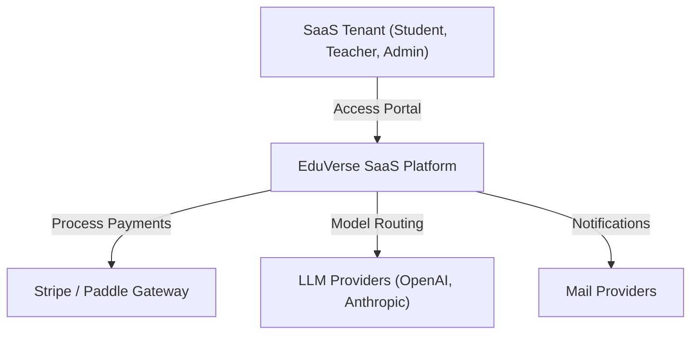
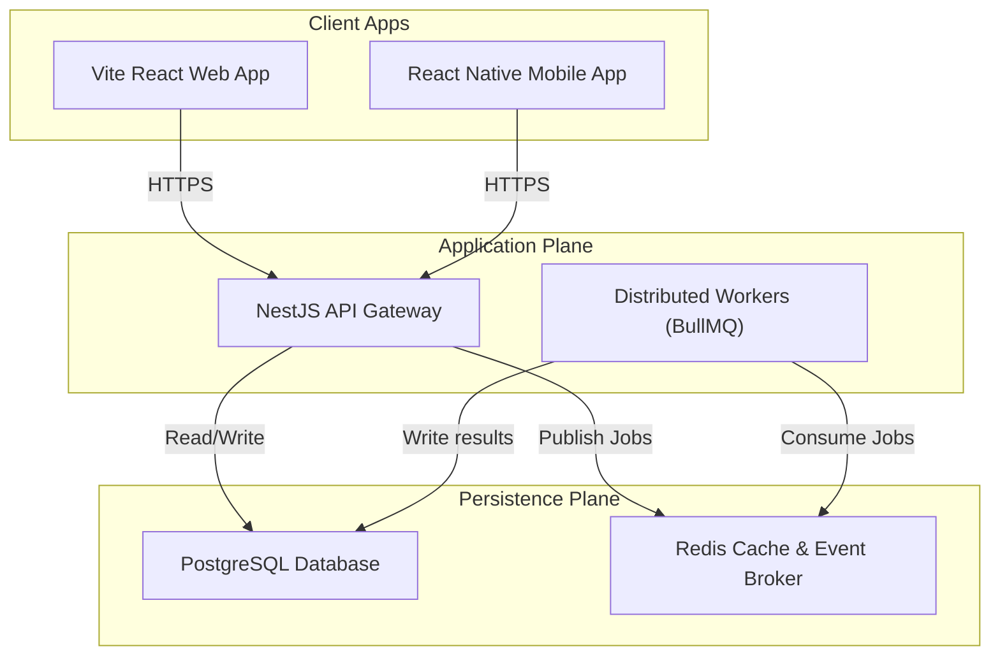
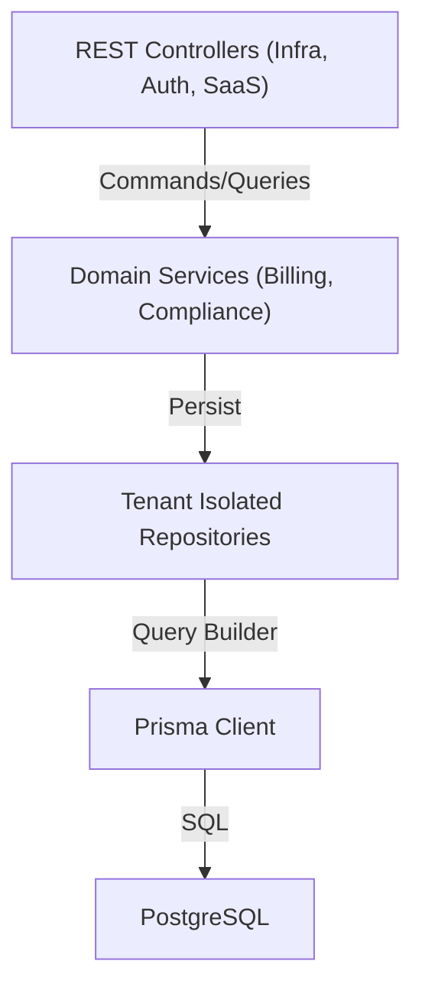
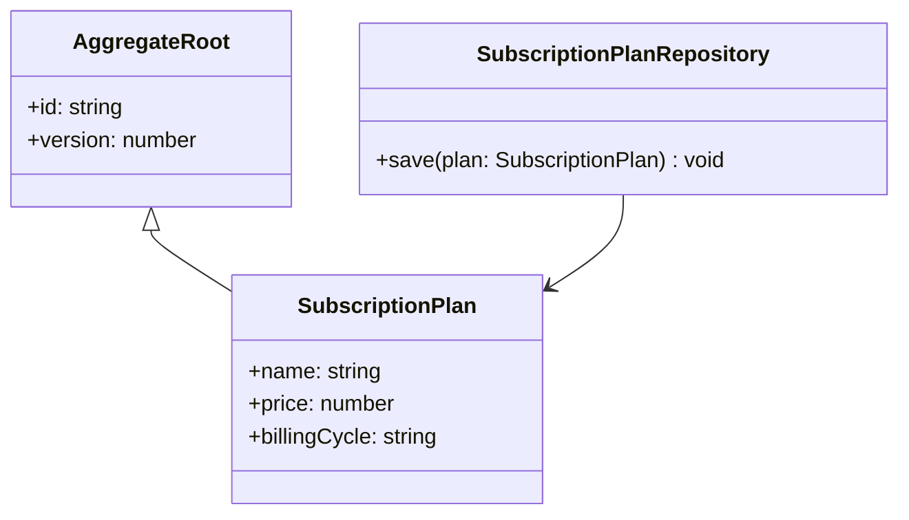

# EduVerse C4 Model Architecture Specifications

This document maps the architectural layers of the EduVerse platform using the C4 Model approach.

---

## 1. Level 1: System Context Diagram
Shows how the system fits into the environment.

---

## 2. Level 2: Container Diagram
Drills down into the containers (logical execution units) of the system.

---

## 3. Level 3: Component Diagram
Shows components inside the NestJS API Gateway container.

---

## 4. Level 4: Code Diagram
Class relationship diagram of a typical domain operation.

