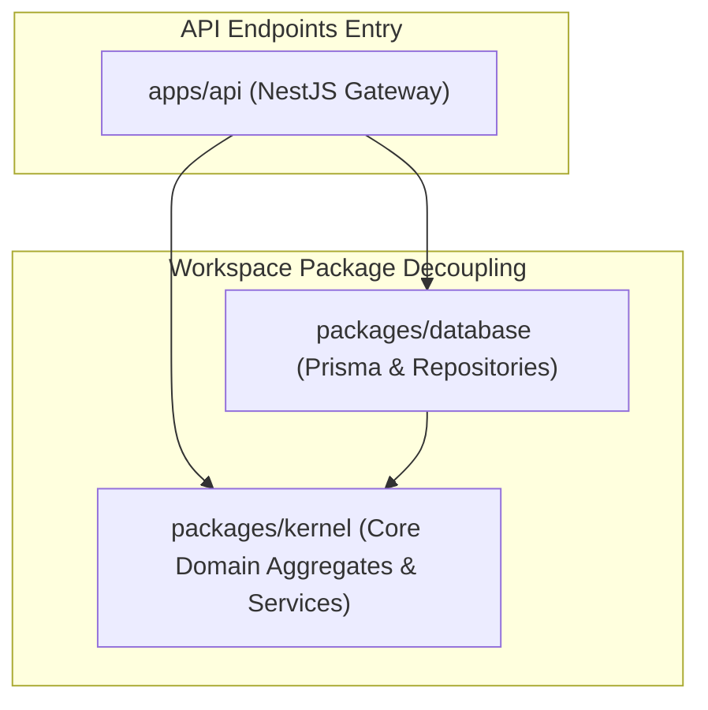

# EduVerse Workspace Package Dependency Graph

This document details the dependency direction of packages within the monorepo workspace.

---

## Workspace Rules
1. **Dependency Inversion**: Core business logic in `packages/kernel` must never import from `packages/database` or `apps/api`.
2. **Repository Abstraction**: Database persistence implements adapters interface defined in kernel.
