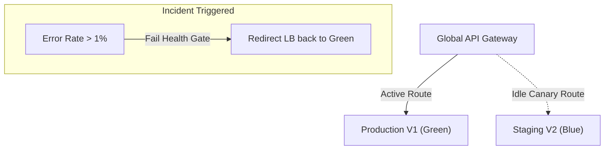

# EduVerse Deployment Guide

This guide details GitOps application deployment configurations across Development, Testing, Staging, and Production environments.

---

## 1. Environment Topology

- **Development**: Sandboxed local docker-compose environment.
- **Testing**: Automated CI pipeline triggering NestJS Jest spec suites.
- **Staging**: Replica production cluster running on Kubernetes namespace `staging`.
- **Production**: Active-active multi-region deployment.

---

## 2. Release & Rollback Orchestration

### Canary Deployments
1. Deploy new image tags to 5% of container replicas.
2. Monitor latency and HTTP 5xx error metrics.
3. Automatically promote to 100% of replicas if error thresholds stay under 0.05%.

### Blue/Green Rollback Strategy

