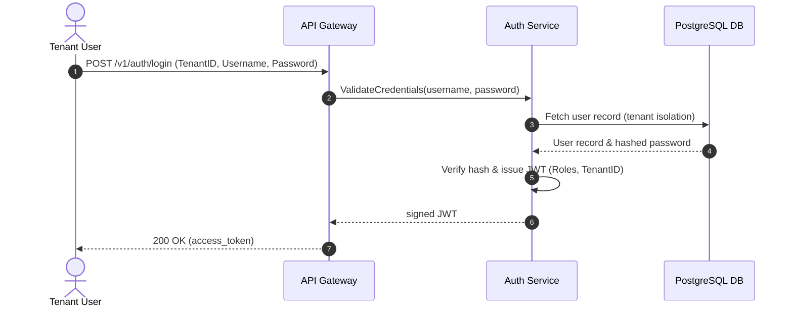
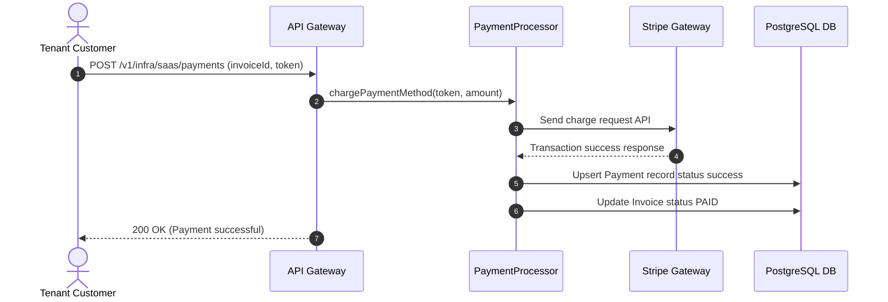
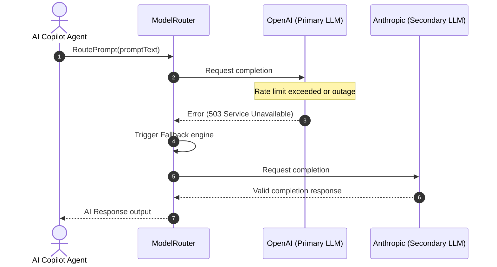

# EduVerse Sequence Diagram Specifications

This document maps core business execution flows on the platform.

---

## 1. Multi-Tenant User Login Flow

---

## 2. Subscription Payment Flow

---

## 3. AI Model Routing & Failover Flow

