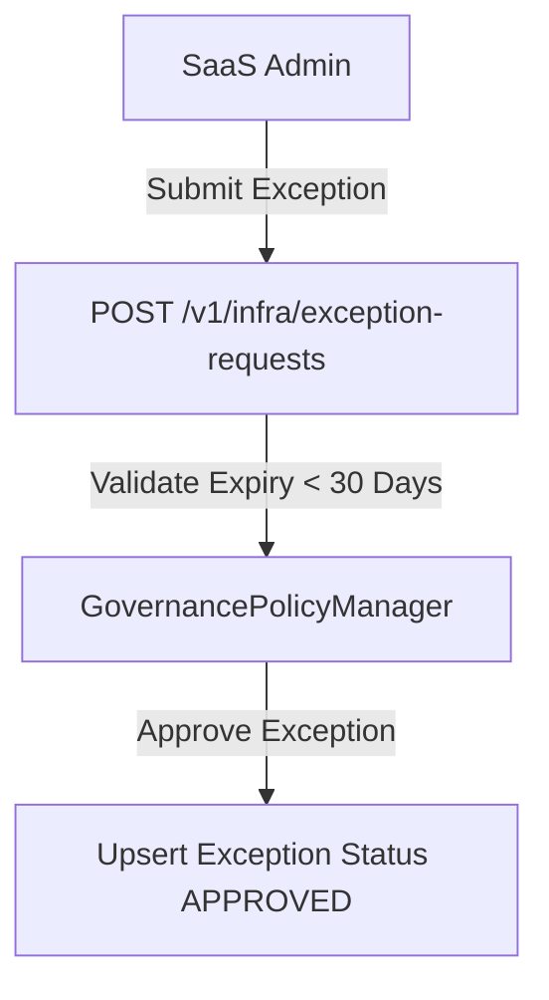

# EduVerse Governance & Compliance Architecture

This document details policies alignment to ISO 27001, GDPR, and FERPA specifications.

---

## 1. Compliance Control Auditing

- **FERPA Compliance**:
  - Encrypts student records in transit (TLS 1.3) and at rest (AES-256).
  - Enforces role access policies, blocking access to student data unless explicitly authorized.
- **GDPR Compliance**:
  - Provides options to clear cookie consent preferences.
  - Implements an automated pipeline to handle user erasure requests (Right to Erasure).
- **ISO 27001 Compliance**:
  - Maintains immutable transaction ledgers recording system infrastructure changes.

---

## 2. Dynamic Policy Exceptions Flow

