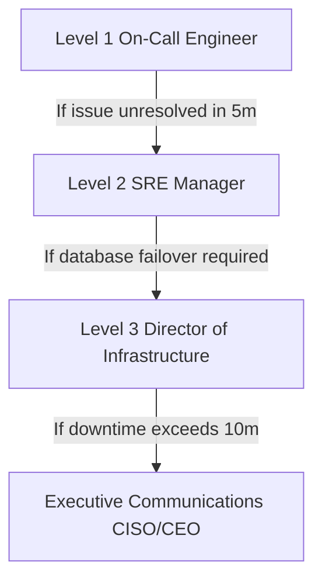

# EduVerse Disaster Recovery Playbook

This document details policies, SLA commitments, RPO/RTO limits, and escalation runbooks.

---

## 1. SLA Commitments

- **RPO (Recovery Point Objective)**: **5 minutes** (maximum database transactions data loss).
- **RTO (Recovery Time Objective)**: **15 minutes** (maximum system offline duration).

---

## 2. Escalation Paths & Communication Plan



---

## 3. Database Failover Runbook

1. **Verify primary region offline status**: Run `kubectl get nodes --context=primary`.
2. **Promote read-replica in secondary region**: Run regional promote script:
   ```bash
   ./scripts/db-promote-replica.sh eu-west-1
   ```
3. **Re-route Load Balancer ingress rules**: Apply traffic weights shift:
   ```bash
   kubectl apply -f k8s/glb-ingress-secondary.yaml
   ```
4. **Publish platform status update**: Inform tenants via notification channels.
