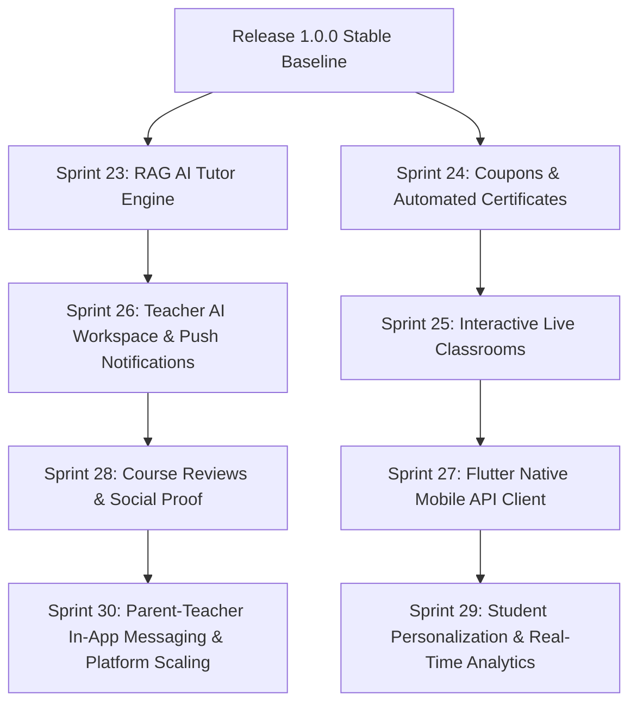

# EDUVERSE — FEATURE DEPENDENCY GRAPH

**Document ID:** `FEATURE-DEPENDENCY-GRAPH`  
**Date:** August 15, 2026  
**Release Baseline:** `v1.0.0 GA`  

---

## 1. Feature Dependency Flowcharts

```mermaid
graph TD
    Baseline[Release 1.0.0 Stable Baseline] --> S23[Sprint 23: RAG AI Tutor Engine]
    Baseline --> S24[Sprint 24: Coupons & Automated Certificates]
    S23 --> S26[Sprint 26: Teacher AI Workspace & Push Notifications]
    S24 --> S25[Sprint 25: Interactive Live Classrooms]
    S25 --> S27[Sprint 27: Flutter Native Mobile API Client]
    S26 --> S28[Sprint 28: Course Reviews & Social Proof]
    S27 --> S29[Sprint 29: Student Personalization & Real-Time Analytics]
    S28 --> S30[Sprint 30: Parent-Teacher In-App Messaging & Platform Scaling]
```
