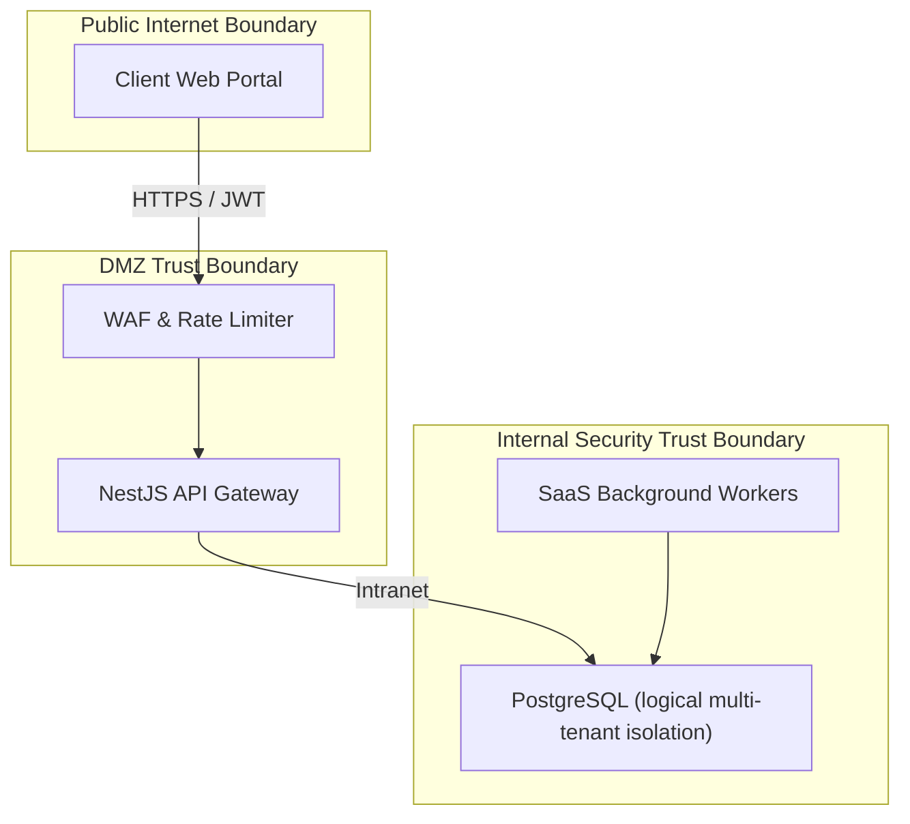

# EduVerse Threat Modeling & Security Hardening

This document maps potential system security threats using the **STRIDE** and **DREAD** assessment frameworks.

---

## 1. STRIDE Threat Vector Mapping

| Vector | Threat Identified | Mitigating Control |
| :--- | :--- | :--- |
| **Spoofing** | Unauthorized JWT token reproduction | RSA-256 asymmetric signatures and rotation |
| **Tampering** | Mutation of invoice amounts | Cryptographic transaction hashing |
| **Repudiation** | Denying evidence uploads | Log audits signed with SHA-256 |
| **Info Disclosure** | Cross-tenant data leakage | Logical row-level filtering by `tenantId` |
| **Denial of Service** | API gateway flood | Redis-based rate limiters on route paths |
| **Elevation of Priv** | Manipulation of JWT role attributes | Strict RBAC controls verification |

---

## 2. DREAD Risk Score Matrix

* **Damage**: 1 (Low) to 5 (Critical)
* **Reproducibility**: 1 to 5
* **Exploitability**: 1 to 5
* **Affected Users**: 1 to 5
* **Discoverability**: 1 to 5

| Risk Vector | Damage | Repr | Expl | Aff | Disc | DREAD Score |
| :--- | :---: | :---: | :---: | :---: | :---: | :---: |
| **Cross-Tenant Data Leak** | 5 | 1 | 2 | 5 | 1 | **2.8 / 5.0 (Medium)** |
| **DDoS API Flooding** | 4 | 5 | 5 | 5 | 5 | **4.8 / 5.0 (High)** |
| **Unsigned Token Spoof** | 5 | 2 | 2 | 5 | 2 | **3.2 / 5.0 (Medium)** |

---

## 3. Trust Boundaries Diagram

